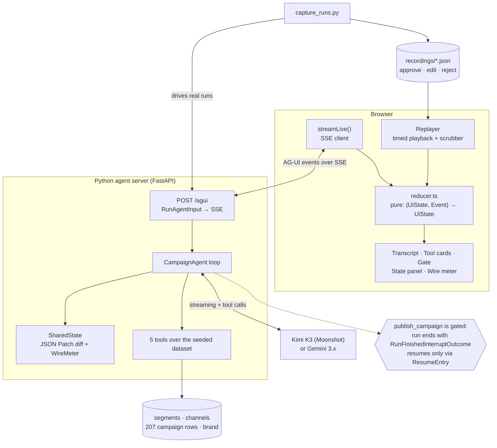

# Architecture — AG-UI Campaign Copilot

## Overview

Three pieces, one protocol between them.

A **Python agent server** runs a tool-calling loop over a seeded marketing dataset and
emits everything it does as typed AG-UI events over Server-Sent Events. A **React
frontend** turns that event stream into UI through a single pure reducer. A **capture
harness** drives real runs over HTTP, records the resulting event streams to JSON, and
those recordings become the payload for a **static GitHub Pages replayer** that feeds the
same reducer from a file instead of a socket.

The important structural decision is that the reducer is the only thing that knows how to
turn AG-UI events into UI. Live mode and replay mode differ *only* in where events come
from. The published site is therefore not a mock-up of the app — it is the app, running on
recorded input.

The second structural decision is that the human approval gate is enforced in the agent
loop, not in the UI. A gated tool never executes on the path that proposes it. The run
terminates with an interrupt outcome and can only continue via a resume request that names
the interrupt id. A frontend that simply ignored the gate would not be able to publish
anything.

## System diagram

## Components

| Component | Responsibility | Tech |
|---|---|---|
| `backend/app/main.py` | AG-UI HTTP surface: validates `RunAgentInput`, holds per-thread sessions, streams encoded events | FastAPI, `ag_ui.encoder.EventEncoder` |
| `backend/app/agent.py` | The agent loop; emits every AG-UI event; owns the interrupt/resume state machine | `ag-ui-protocol` 0.1.19 |
| `backend/app/state.py` | Shared campaign state, before/after diff → RFC 6902 patches, and the wire-byte meter | `jsonpatch` |
| `backend/app/tools.py` | Five real functions over the dataset, their JSON Schemas, and the gated-tool registry | Python stdlib |
| `backend/app/llm.py` | Streaming clients for Moonshot (OpenAI-compatible) and Gemini, normalised to one chunk protocol | `httpx` |
| `backend/scripts/seed_dataset.py` | Deterministic generator for the marketing dataset | Python stdlib |
| `backend/scripts/capture_runs.py` | Drives real runs over HTTP through all three human paths; writes recordings | `httpx` |
| `frontend/src/agui/reducer.ts` | The single AG-UI→UI reduction. Pure and total, so any prefix of the stream is a valid frame | TypeScript, `fast-json-patch` |
| `frontend/src/agui/sources.ts` | The two event sources: live SSE reader, and the timed `Replayer` with keyframe caching | TypeScript |
| `frontend/src/components/*` | Transcript, tool cards, approval gate, state panel, wire meter, scrubber | React 19 |
| `frontend/scripts/validate-recordings.mjs` | Cross-language conformance: validates recorded events against the official TS schemas | `@ag-ui/core` 0.0.57 |
| `.github/workflows/deploy.yml` | Validates, builds, and publishes the replayer | GitHub Actions, Pages |

## Data flow

### A normal run

1. The client POSTs a `RunAgentInput` to `/agui`. The server creates a session keyed by
   `threadId` and returns an SSE stream.
2. `RUN_STARTED`, then one `STATE_SNAPSHOT` to seed the client's copy of campaign state.
   This is the only full state transfer in the run.
3. Per agent turn: `STEP_STARTED`, then the model streams. Text becomes
   `TEXT_MESSAGE_START` → many `TEXT_MESSAGE_CONTENT` → `TEXT_MESSAGE_END`. Tool calls
   become `TOOL_CALL_START` → `TOOL_CALL_ARGS` → `TOOL_CALL_END`.
4. The tool executes against the dataset. Its result goes out as `TOOL_CALL_RESULT` and is
   appended to the model's history.
5. The result is *projected* into shared state — segment chosen, benchmarks loaded, budget
   allocated, variants drafted, compliance recorded. `SharedState.mutate` deep-copies the
   state, applies the mutation, diffs before against after, and emits the resulting patch
   as `STATE_DELTA`. Nothing else touches state, so nothing can change without a patch.
6. When the model stops calling tools, the server emits a `CUSTOM` event named `wire_meter`
   with the byte accounting, then `RUN_FINISHED` with a success outcome.

### The gate

When the model calls `publish_campaign`:

1. `TOOL_CALL_START` / `_ARGS` / `_END` are emitted, so the UI can render exactly what the
   agent proposed — **but the tool is not executed**.
2. The pending call is stashed on the session, and a `STATE_DELTA` moves `approval.status`
   to `pending`.
3. The run terminates with `RUN_FINISHED` whose outcome is `RunFinishedInterruptOutcome`,
   carrying an `Interrupt` with an id, `reason: "human_approval_required"`, a human-readable
   message, the originating `toolCallId`, a `responseSchema` describing the decision the
   agent wants, and metadata containing the proposed arguments.
4. Nothing further happens until a new `RunAgentInput` arrives on the same thread with a
   `resume` array containing a `ResumeEntry` for that interrupt id.

On resume, the decision in `ResumeEntry.payload` selects the path:

- **approve** — the stashed call executes with its original arguments; `TOOL_CALL_RESULT`
  and a `published` state patch follow.
- **edit** — the human's edits are merged into the stashed arguments first. Budget
  reallocations and campaign renames overwrite the proposal; rewritten copy is merged into
  state and flagged `edited_by_human`, which subsequent model drafts are forbidden to
  overwrite. The *edited* version is what publishes.
- **reject** — the tool never executes. A synthetic tool result telling the model it was
  blocked is fed back into history, state moves to `rejected`, and the system prompt
  forbids re-calling `publish_campaign` in that run. The model acknowledges and proposes
  next steps instead.

### Replay

`capture_runs.py` performs exactly the above over real HTTP, recording each event with its
arrival offset in milliseconds, plus a synthetic `RAW` event marking where the human
decided. The frontend's `Replayer` walks that array on a `setTimeout` schedule derived from
the recorded offsets (with extra dwell inserted at the gate so it is readable), feeding the
same reducer. Seeking is a re-fold of the prefix, which is correct by construction because
the reducer is pure; keyframes every 100 events and a last-position cache keep that cheap
even for the ~1,700-event runs a token-streaming model produces.

## Deployment

The published site is **static only**. GitHub Actions installs the frontend, runs the
conformance check against the committed recordings, builds with Vite (base path
`/ag-ui-campaign-copilot/`), and publishes `frontend/dist` to GitHub Pages via
`configure-pages` → `upload-pages-artifact` → `deploy-pages`. Any push to `main` redeploys.

The recordings are copied into `frontend/public/recordings` at build time and fetched
lazily by the app, so only the selected scenario is downloaded.

There is no backend deployment. The live agent runs locally only — `docker compose up`
brings up the Python service and a Vite dev server wired to it via `VITE_AGENT_URL`, at
which point the approval buttons drive a real model instead of replaying a recording.

## Tech choices & rationale

**Why raw AG-UI over SSE, not CopilotKit.** The claim under test is about the protocol. Using
an integration framework would have measured the framework instead. Everything here talks to
`ag-ui-protocol` and `@ag-ui/core` directly, which also let me check the two SDKs against
each other: all recorded events emitted by the Python encoder validate against the
TypeScript zod schemas with no adaptation layer.

**Why a pure reducer.** It buys three things at once: live and replay share one rendering
path (so the Pages site is honest), scrubbing is trivially correct because seeking is just
re-folding a prefix, and the wire meter can be recomputed client-side from the events
themselves rather than trusted from the server.

**Why the tools do real arithmetic.** A campaign copilot whose tools return lorem ipsum
would not test anything. `get_channel_benchmarks` aggregates 207 historical rows into CTR,
CPC, cost-per-MQL and pipeline ROAS. `allocate_budget` runs a real constrained allocator:
softened ROAS weights, minimum-viable-spend floors, and a concentration cap with
redistribution. Its output is checkable, and the agent has to reason about numbers it did
not invent.

The allocator needed two rewrites during the build, both caught by running it rather than
reading it. Weighting channels in direct proportion to ROAS handed ~100% of the budget to
the single best channel and then min-spend pruning eliminated everything else; damping the
weights to `roas^0.5` and seating each funded channel at its floor *before* distributing
the remainder produces the multi-channel split a media planner would actually ship. The
seeded dataset also needed rebuilding after the first version produced a 32,979× ROAS on
email — the funnel had been generated forward from CPM impressions instead of from
cost-per-MQL, which made cheap-CPM channels absurd.

**Why Kimi K3 for the committed recordings.** Both a Gemini client and a Moonshot client
are implemented and both were verified working end to end. The Gemini key's prepayment
credits were exhausted partway through the build, so the recordings shipped here are from
`kimi-k3`. This turned out to be useful evidence for the protocol's provider-independence:
swapping providers changed one environment variable and no protocol code, because both
clients normalise to the same internal chunk shape before anything becomes an AG-UI event.
Two model-specific quirks did need handling — Gemini 3.x returns a `thoughtSignature`
alongside function calls that must be echoed back verbatim in history, and `kimi-k3`
rejects any `temperature` other than 1.

**Why variants are read from tool arguments.** Initially the agent's copy variants were
parsed out of its prose using a `VARIANT id | channel | copy` convention. That silently
failed whenever the model put the variants only in its `check_copy_compliance` arguments and
not in its prose — which cost me a completely empty variant list at the approval gate on the
edit run. Tool arguments are now authoritative; prose parsing remains only as a
presentational nicety. The general lesson is that structured tool arguments are the reliable
channel and prose is not.

## Known limitations / tradeoffs

- **The published site is a replayer, not a live agent.** This is stated on the page itself.
  GitHub Pages cannot host the model loop, and I would rather ship an honest recording than
  a fake stream.
- **Sessions are in-memory.** A server restart orphans any pending interrupt. Real
  deployments need durable sessions; AG-UI does not specify how.
- **The interrupt ends the HTTP response.** AG-UI models a pause as a *terminal run outcome*
  plus a later resume, not as a held-open socket. From the user's point of view the run is
  blocked, but on the wire it is two runs sharing a thread id. This is the protocol's design,
  and it is the right one for durability — but it means "the run is paused" is a UI-level
  fiction maintained by the client.
- **Edit semantics are mine, not the protocol's.** `ResumeEntry.payload` is untyped. What an
  "edit" means is a private contract between this backend and this frontend.
- **Which tools are gated is my policy.** AG-UI supplies the pause mechanism; it has nothing
  to say about which actions deserve one.
- **Recordings are large.** A token-streaming model emits ~1,700 events for one run,
  dominated by single-token `TEXT_MESSAGE_CONTENT` frames. The approve recording is ~330 KB
  of JSON. It compresses well and loads lazily, but per-token events over SSE are not free.
- **No tests beyond conformance and manual browser verification.** There is a schema
  conformance check in CI and the UI was verified in a real headless Chromium (all three
  scenarios, mobile viewport, both themes), but there is no unit suite.
- **Tool-call arguments do not stream.** Both providers return complete argument objects, so
  `TOOL_CALL_ARGS` arrives as a single chunk even though the protocol supports many. The
  incremental-args capability is untested here.
